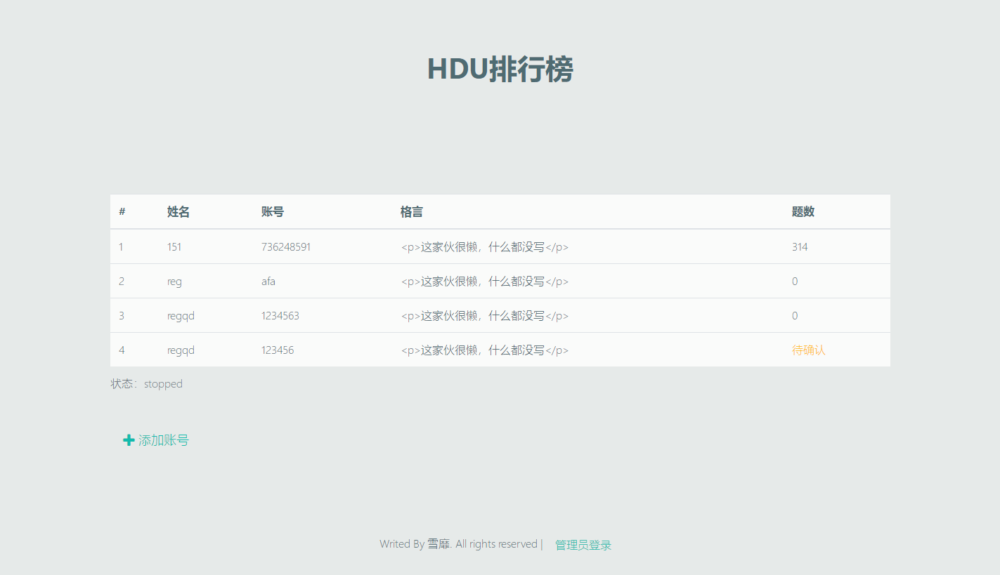
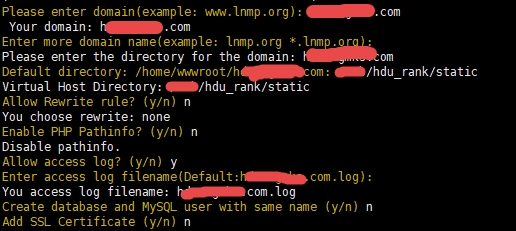

# 说明

HDU_Rank是一款基于基于Flask、Vue.js和BootstrapVue的杭电刷题排行榜爬虫。

DEMO页面：



注意：由于本项目中使用到了Python3的uWSGI库，因此只能运行在Linux平台上面。

# 快速入门

```shell
# 依赖包
yum install libffi-devel -y
# 安装Python3（如果已经安装可以跳过）
wget https://www.python.org/ftp/python/3.7.3/Python-3.7.3.tgz
tar -zxvf Python-3.7.3.tgz
cd Python-3.7.3
./configure
make && make install

# 安装LNMP环境（如果已经安装可以跳过）
wget http://soft.vpser.net/lnmp/lnmp1.6beta.tar.gz
tar -zxvf lnmp1.6beta.tar.gz
cd lnmp1.6beta
./install.sh
# 其中MySQL版本建议选择MySQL8，其余根据需求选择

# 安装screen和git（如果已经安装可以跳过）
yum install screen git vim -y
# 安装所需的PIP库
pip3 install flask pymysql requests uWSGI
# 增加hdurank的用户名和组
/usr/sbin/groupadd hdurank
/usr/sbin/useradd -g hdurank hdurank
# 克隆本项目
git clone https://github.com/736248591/hdu_rank.git
# 建立数据库
cd hdu_rank
mysql -u你的数据库用户名 -p你的数据库密码 < hdu_rank.sql
# 新建域名
lnmp vhost add
# 按照提示填写你的域名和项目本地存放的地址。注意，网站的根目录填写的是hdu_rank/static
```

```shell
# 编辑NGINX的配置
vim /usr/local/nginx/conf/vhost/你的域名.conf
# 在server的子级location的同级加入以下内容。
location ~* /api/{
    include  uwsgi_params;
    uwsgi_pass  127.0.0.1:5007;
    client_max_body_size 35m;
}
# 重启nginx服务器
lnmp nginx restart
# 开启新的一个screen，这样在关闭终端以后程序不会被关闭
screen -R hdu_rank
# 创建管理员密码 
vim admin.key
# 启动服务器
uwsgi --ini uwsgi.ini 
```
# 进阶开发

## API接口

- ### /api/get_rank 获取排行榜
**参数：** （无）
**响应数据：**
```
  {
      "status": 操作状态 Boolean,
      "msg": 错误原因 (当状态为false时，拥有这个字段）string,
      "users": 用户列表(当状态为True时，拥有这个字段）
      [
          [
              id 用户ID unsigned int,
              name 姓名 string,
              account 账号 string,
              motto 格言 string,
              solved_num 题数 int,
              status 状态 union("unchecked","fetching","active")
          ]
      ]
  }
```

- ### /api/validate_user 验证用户
  **参数：**
| 字段名 | 数据类型 | 默认值 |  描   述   |
| :----: | :------: | :----: | :--------: |
| account |  string(64)  |        |  账号  |
**响应数据：**
```
  {
      "status": 是否合法 Boolean,
      "mgs": 不合法的时候拥有这个字段，表示不合法的原因。
  }
```


- ### /api/add 添加用户
  **参数：**
| 字段名 | 数据类型 | 默认值 |  描   述   |
| :----: | :------: | :----: | :--------: |
| name	 | string(16) |        | 姓名  |
| account |  string(64)  |        |  账号  |
|  motto | string(255) |        |   格言   |
**响应数据：**

```
  {
      "status": 操作状态 Boolean,
      "mgs": 错误原因 (当状态为false时，拥有这个字段）string
  }
```

- ### /api/remove 删除用户
**说明：** 必须先登录才能使用该接口。
**参数：**
| 字段名 | 数据类型 | 默认值 |  描   述   |
| :----: | :------: | :----: | :--------: |
| id	 |   unsigned int |        | 用户ID  |
**响应数据：**
```
  {
      "status": 操作状态 Boolean,
      "mgs": 错误原因 (当状态为false时，拥有这个字段）string
  }
```

- ### /api/login_admin 管理员登录
**说明：** 登录的token留在Session中。
**参数：**
| 字段名 | 数据类型 | 默认值 |  描   述   |
| :----: | :------: | :----: | :--------: |
| pwd	 |   string |        | 管理员密码<br/>字段=sha3-512(PWD+time%10000+PWD) |
**响应数据：**

```
  {
      "status": 操作状态 Boolean,
      "mgs": 错误原因 (当状态为false时，拥有这个字段）string
  }
```

- ### /api/logout_admin 管理员登出
**说明：** 清空session。
**参数：** (无)
**响应数据：**
```
  {
      "status": 操作状态 Boolean,
      "mgs": 错误原因 (当状态为false时，拥有这个字段）string
  }
```

- ### /api/confirm 确认用户

  **说明：** 必须先登录才能使用该接口。
  **参数：**
| 字段名 | 数据类型 | 默认值 |  描   述   |
| :----: | :------: | :----: | :--------: |
| id	 |   unsigned int |        | 用户ID  |
**响应数据：**
```
  {
      "status": 操作状态 Boolean,
      "mgs": 错误原因 (当状态为false时，拥有这个字段）string
  }
```

- ### /api/get_login_info 获取登录信息
**参数：** （无）
**响应数据：**
```
  {
      "status": 操作状态 Boolean,
      "mgs": 错误原因 (当状态为false时，拥有这个字段）string,
      "is_admin":是否已经登录管理员权限 Boolean
  }
```

- ### /api/crawl_start 开始滚版
**说明：** 必须先登录才能使用该接口。
**参数：**（无）
**响应数据：**
```
  {
      "status": 操作状态 Boolean,
      "mgs": 错误原因 (当状态为false时，拥有这个字段）string
  }
```

- ### /api/crawl_stop 停止滚榜
**说明：** 必须先登录才能使用该接口。
**参数：**（无）
**响应数据：**
```
  {
      "status": 操作状态 Boolean,
      "mgs": 错误原因 (当状态为false时，拥有这个字段）string
  }
```

- ### /api/crawl_status 爬虫状态
**参数：**（无）
**响应数据：**
```
  {
      "status": 操作状态 Boolean,
      "mgs": 错误原因 (当状态为false时，拥有这个字段）string
      "crawl_status": 爬虫状态 union("runable","running","sleeping","stopped")
  }
  
```

- ### /api/add_notice 添加通知
**参数：**
| 字段名 | 数据类型 | 默认值 |  描   述   |
| :----: | :------: | :----: | :--------: |
| notice	 |   string |        | 通知  |
**响应数据：**
```
  {
      "status": 操作状态 Boolean,
      "mgs": 错误原因 (当状态为false时，拥有这个字段）string
  }
  
```

## 手动编译客户端
安装Node.js和Yarn
```shell
cd hdu_rank
yarn global add @vue/cli
yarn install
yarn build
```

## 更新日记

### 2019年9月25日

- 删除了没用的右上角丝带，github地址添加到页脚，避免移动端的页面变得很恶心。
- 修改页面语言标签的错误。
- 在账号合法性判断之前，添加了对杭电OJ连接的判断。
- 改善移动端的显示体验。

### 2019年9月23日

- 修改数据库Users表中name字段大小，从长度为8改为16。
- 在添加账号之前，先对账号进行验证。
- 修正了无法写入日记的错误。日记写入位置为/tmp/uwsgi.pid
- 更新了依赖包，重新编译网页客户端。

### 2019年9月3日

- 修改设定的备注，并且修改主循环默认为30分钟循环一次。

### 2019年9月2日

- 更新了依赖包，重新编译网页客户端。

#### 2019年7月28日

- 修正输入管理员密码回车时候，不登录而刷新页面的操作。
- 公告支持Markdown语法高亮。
- 更新了所有组件。
- 右上角添加了包含github项目链接的丝带。
- 修正添加用户成功以后，用户信息仍然存在表单中的问题。
- 修正管理员登录以后，密码仍然储存在表单中问题。
- 修正重新开启网页以后，公告不可以修改，只能新建的问题。
- 删除产品模式下的所有console.log输出。


#### 2019年5月31日

- 更新所有组件，移除安全隐患。
- 移除了富文本编辑器。
- 增加了添加公告功能。
- 修复长时间不使用的时候，MySQL连接掉线问题。

#### 2019年5月31日

- 更新AXIOS到0.19.0使得修复其安全漏洞。
- 顺带更新一下其他的组件。

#### 2019年5月26日

- 升级了依赖包的版本，解决安全隐患。

- 修复了数据库文件导入的BUG。

- 添加了说明文档中python3.7需要的依赖。

- 未创建管理员密码错误。

- 添加了网站的图标和标题。

#### 2019年4月24日
- 当密码不存在的时候会自动生成新密码保存在admin.key文件里面。

#### 2019年4月9日 

1.0 初次发布